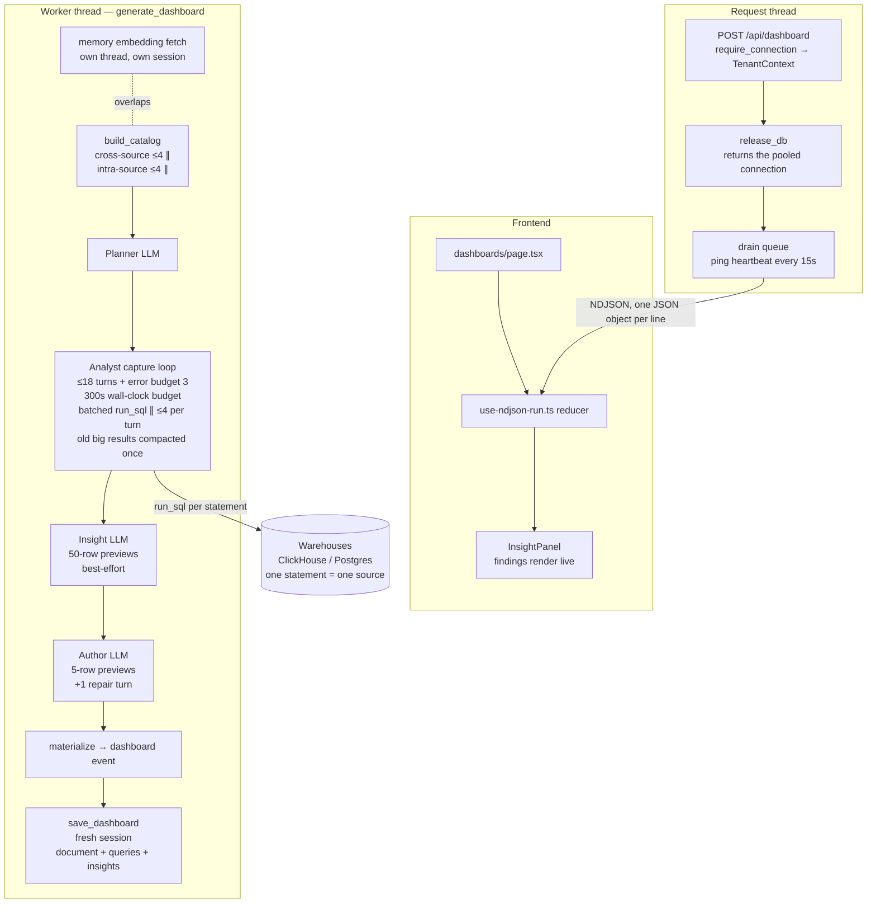
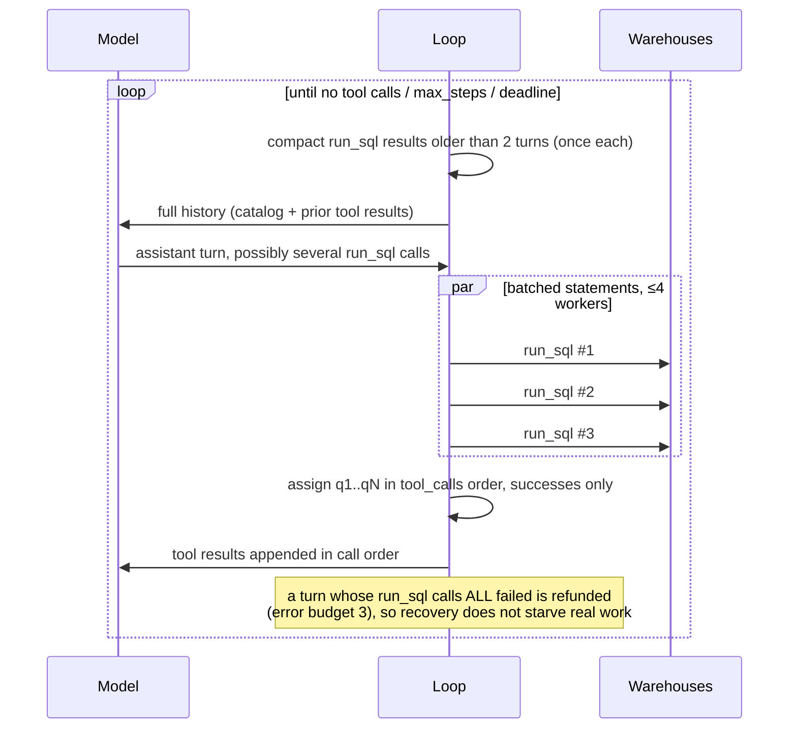
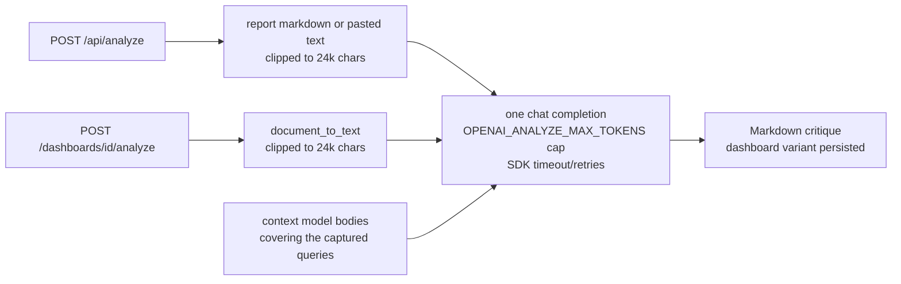

# Dashboard generation & analyze mode — pipeline architecture

How a dashboard request becomes a rendered grid, how analyze/critique mode
differs, and which parts run in parallel. File references point at the
orchestrators: `datatalk/agent/dashboard.py`, `datatalk/agent/sqlloop.py`,
`datatalk/web/app.py`.

## The dashboard pipeline

Four LLM stages, orchestrated by `generate_dashboard()`: Planner → Analyst
(capture loop) → Insight → Author. Only the Analyst touches a warehouse. The
LLM never types numbers: agents emit *authoring* blocks that reference captured
datasets by id, and `materialize()` fills in real values.

Key structural rules (enforced in code, not convention):

- **`TenantContext` is the only handle** to a warehouse or OpenAI client.
  Frozen and session-free, built per request in `auth/orgs.py`, safe to hand to
  the worker thread. No `Session` is ever touched from `agent/` or
  `warehouse/`.
- **The request session is released before streaming.**
  `RequestContext.release_db()` runs as the first line of every stream
  generator; the post-run save opens its own short-lived session on the
  draining thread.
- **A statement targets one source.** There is no cross-source SQL; the
  Analyst queries each warehouse separately and the Author relates datasets
  across blocks.

### The capture loop (`sqlloop.run_capture_loop`)

The shared agentic loop under the Analyst, Q&A, and the docs profiler. Tools:
`run_sql(source, sql)`, `describe_source(source, table)`, and — when the org
has a context model — `read_context(paths)`.

Latency and cost properties:

- **Intra-turn parallelism.** The analyst prompt tells the model to batch a
  whole row of widget queries per turn; the loop executes them concurrently
  (both warehouse clients are built for concurrent use). Dataset ids stay
  deterministic: assigned after the batch, in `tool_calls` order, to successes
  only. `sql`/`result`/`error` events carry a `query_id` so the UI attributes
  out-of-order completions correctly.
- **History compaction.** The loop resends its whole history every turn, so a
  50-row tool result would otherwise be paid for on every remaining turn.
  Results older than 2 turns and larger than 20 rows are rewritten **once** to
  their first 5 rows (the dataset itself keeps every row). Once and never
  again: OpenAI-compatible providers prefix-cache the unchanged head of the
  conversation, and a churning message would forfeit that every turn.
- **Bounded by three budgets**: `max_steps` (turns), `error_budget` (refunded
  all-error turns), and `deadline_s` (wall clock). All three exits land on the
  same forced-finalize path, keeping whatever data was captured.

### The NDJSON wire contract

One `{"kind": ..., "data": {...}}` object per line (`web/streaming.py`).

| kind | data | consumer |
|---|---|---|
| `memory` | `count`, `suggestions[]` | MemoryChip (house rules applied) |
| `status` | `message`, `step?`, `max_steps?` | status line + honest turn counter |
| `plan` | `sections[]` | plan panel, document skeleton |
| `sql` | `sql`, `query_id?`, `source?` | run log: new running step |
| `result` | `dataset_id`, `row_count`, `columns`, `query_id?`, `source?` | resolves its step by `query_id` |
| `error` | `message`, `query_id?` | retry annotation on its step; fatal only if no document ever arrives |
| `insights` | `{insights[], lead[], drop[], gaps[]}` | InsightPanel, live and after |
| `dashboard` / `report` / `answer` | the materialized document | DocumentView |
| `ping` | `{}` | ignored; keeps proxies from killing quiet streams |
| `saved` | `dashboard_id`/`report_id`, `queries`, `steps` | permalink, cache invalidation |
| `done` | `{}` | phase → done |

The `step` counter counts assistant *turns* (a batched turn runs several
queries); the frontend renders the backend's numbers instead of duplicating a
server-side constant.

### Resilience

- **Heartbeat**: the stream emits `ping` after 15 quiet seconds
  (`web/streaming.drain`); the longest legitimately silent window is the
  non-streaming author call.
- **SDK-level retries**: `OPENAI_MAX_RETRIES` / `OPENAI_TIMEOUT_SECONDS` are
  passed to every OpenAI client (`clients.openai_for`), so transient 429/5xx
  are retried below the application with backoff and a hung completion is
  bounded. Deliberately not a hand-rolled retry loop: scripted test fakes sit
  above this layer and stay call-count exact.
- **Insight pass is best-effort**: any failure degrades to "no insights
  block"; the dashboard ships regardless.
- **Memory is best-effort everywhere**: a dead embeddings endpoint degrades
  every path (report, dashboard, analyze) to "no suggestions", never a 500.

## Analyze / critique mode

`POST /api/analyze` (a saved report or pasted external text) and
`POST /api/dashboards/{id}/analyze` (a saved dashboard's materialized numbers).
One LLM call, **zero SQL** — which is why neither endpoint requires a data
source: a connectionless org can still analyze pasted text.

Both calls inject the workspace context model (`build_context_block`) selected
by the report's captured queries, so the critique judges numbers against the
workspace's own definitions.

## Deliberately not done

- **Streaming partial documents.** The author emits one JSON grid, and its
  repair turn may replace the document wholesale — incremental rendering would
  need streaming JSON parsing plus UI invalidation, to cover a window the
  heartbeat and the live insight panel already cover.
- **`cache_control`-style explicit prompt caching.** The stack is
  `openai.OpenAI` only; OpenAI-compatible providers prefix-cache
  automatically, so the actionable form of this idea is compaction's
  "rewrite once, then stable" rule.
- **Cancelling the worker on client abort.** "Stop watching" is the contract:
  the daemon worker runs to completion and persists, so the run still appears
  in the library. The heartbeat surfaces the disconnect server-side.
- **Merging the three dataset serializations** (loop history 50 rows, insight
  50 rows, author 5 rows): three prompts at three deliberate fidelities;
  merging them couples the agents.
